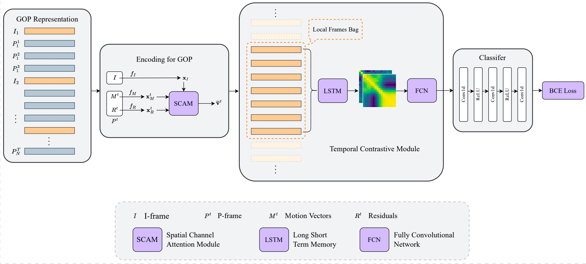

# LCVSL

Official code for **Local Compressed Video Stream Learning for Generic Event Boundary Detection**. <br>

*Libo Zhang, Xin Gu, Congcong Li, Tiejian Luo and Heng Fan*


## Introduction
In this work, we propose an end-to-end compressed video representation learning method for GEBD. Specifically, we convert the video input into successive frames and use the Gaussion kernel to preprocess the annotations. Meanwhile, we design a spatial-channel attention module (SCAM) to make full use of the motion vectors and residuals to learn discriminative feature representations for P-frames with bidirectional information flow. After that, we propose a temporal contrastive module that use local frames bag as representation to model the temporal dependency between frames and generate accurate event boundaries with group similarity. Extensive experiments have conducted on the Kinetics-GEBD and TAPOS datasets demonstrate that the proposed method performs favorably against the state-of-the-art methods.

## Architecture



## Usage

Our proposed method is implemented with PyTorch.

#### 1. Environment

```
pip3 install torch==1.12.1+cu113 torchvision==0.13.1+cu113 torchaudio==0.12.1 --extra-index-url https://download.pytorch.org/whl/cu113
pip3 install -i https://pypi.tuna.tsinghua.edu.cn/simple opencv-python
```

#### 2. Installation

- Clone this repo:

```
git git@github.com:GX77/LCVSL.git
cd LCVSL
```

#### 3. Download datasets

- [Kinetics-400](https://www.deepmind.com/open-source/kinetics)
- [TAPOS](https://sdolivia.github.io/TAPOS/)

#### 4. Training

```
python3 train.py --config-file config/end_to_end_sidedata_mv_res.yaml /
                 --test-only False /
                 --all-thres False
```

#### 5. Testing

```
python3 train.py --config-file config/end_to_end_sidedata_mv_res.yaml /
                 --test-only True /
                 --resume Model_path /
                 --all-thres True
```